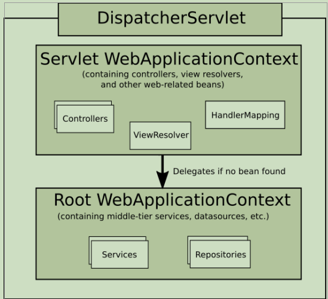

# Spring MVC实践
## 1.概述入门：
### 1.1 核心组件
> DispatcherServlet: 核心入口
* Controller : 声明控制类
* xxResolver : 解析器
  + ViewResolver: 
  + HandlerExceptionResolver:
  + MultipartResolver:
* HandlerMapping:

### 1.2 常用注解
* @Controller
    - RestController
* @RequestMapping
    - @GetMapping/ @PostMapping
    - @PutMapping/@DeleteMapping
* @RequestBody/@ResponseBody/@ResponseStatus

### 1.3 Spring的应用程序上下文

关于上下问题常用的接口
* BeanFactory
    - DefaultListableBeanFactory
* ApplicationContext
    - ClassPathXmlApplicationContext
    - FileSystemXmlApplicationContext
    - AnnotationConfigApplicationContext
* WebApplicationContext

