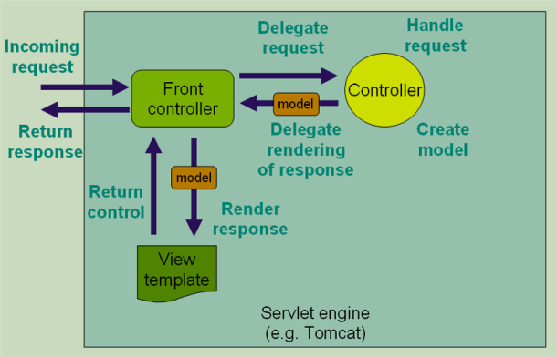

# Spring MVC实践
## 1.SpringMvc的请求处理流程：
+ 发送请求
+ 前端控制器（DispatcherServlet）处理请求
+ 通过HandlerMapping(处理映射)获取对应Handler
+ 通过HandlerAdapter(处理适配器)执行handler
+ 执行完返回响应ModelAndView
+ 通过ViewResolver(视图解析器)返回，建model数据渲染到响应结果并返回

## 2. 如何定义方法
### 2.1 定义映射关系
+ @Controller : 声明类
+ @RequestMapping: 声明资源路径，即可放类，也可绑定方法上
    - path/method:指定映射路径与方法
    - parms/headers：限制映射范围
    - consumes/produces: 限定请求和响应头消息
一些快捷定义：
+ @RestController
+ @GetMapping/@PostMapping/@PutMapping/@PatchMapping
+ @RequestBody/@ResponseBody/@ResponseStatus
+ @PathVariable/@RequestParams/@RequestHeader
+ HttpEntity/ReponseEntity

### 2.2 定义类型转换：
    自己实现WebMvcConfigurer
+ Spring Boot在WebMvcAutoConfiguration中实现一个
+ 添加自定义的Converter
+ 添加自定义的Formatter

### 2.3 定义校验
+ 通过Validator对绑定结果进行校验
    -Hibernate Validator
+ @Valid 注解
+ BindingResult

### 2.4 Multipart 上传
+ 配置MultipartResolver
+ SpringBoot自动配置开启（MultipartAutoConfiguration）
+ 支持类型multipart/form-data
+ MultipartFile类型

