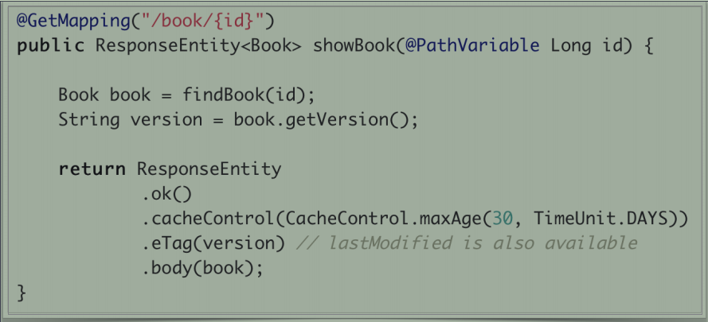
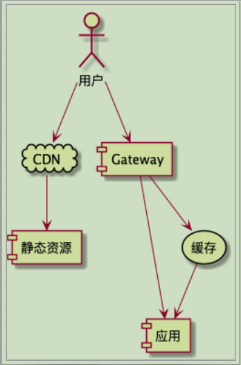

## 静态资源与缓存设置
### 静态资源
+ 核心逻辑：
    + WebMvcConfigurer.addResourceHandlers()
+ 常用配置：
    + spring.mvc.static-path-pattern=/static/** 用于指定访问地址格式 
    + spring.resources.static-locations=classpath:/META-INF/resources/,classpath:/resources/,classpath:/static/  指定应用里资源存放路径，以及静态资源检索路径顺序
### 缓存设置
**常用配置（默认时间单位：秒）**
+ ResourceProperties.Cache 核心类
+ spring.resources.cache.cachecontrol.
    - max-age=时间 ：从接收到文档起最大缓存时间
    - no-cache=true/false ：是否缓存
    - s-max-age=时间 ：共享（公有）缓存的max-age
+ 代码中实现缓存配置：

### 推荐的静态资源和缓存访问方式

## SpingMvc的异常处理
### 异常解析
**核心接口**
+ HandlerExceptionResolver
**实现类**
+ SimpleMappingExceptionResolver
+ DefaultHandlerExceptionResolver
+ ResponseStatusExceptionResolver
+ ExceptionHandlerExceptionResolver  
**处理方法**
+ @ExceptionHandler : 在方法上表明异常处理对象
**添加位置**
+ @Controller/@RestController
+ @ControllerAdvice/@RestControllerAdvice

### 自定义一个异常处理类，并验证

## Spring MVC的拦截器
### 核心接口
+ HandlerInteceptor
    + boolean preHandle()
    + void postHandle()
    + void afterCompletion()

**针对@ResponseBody和ResponseEntity的情况**
+ ResponseBodyAdvice

**针对异步请求的接口**
+ AsyncHandlerInterceptor
    + void afterConcurrentHandlingStarted()
### 拦截器的配置方式
**常规方法**
+ WebMvcConfigurer 
    - .addInterceptors() 实现这个接口，并重写改方法内容

**Spring Boot中的配置**
+ 创建一个带@Configuration的WebMvcConfigurer配置类
+ 不能带 @EnableWebMvc (除非像自己彻底控制MVC配置除外)

> 课程实战：添加一个拦截器，实现拦截打印方法执行时间相关摘要信息
    [SpringMVC_InterceptorDemo](SpringMvc_InterceptorDemo.md)