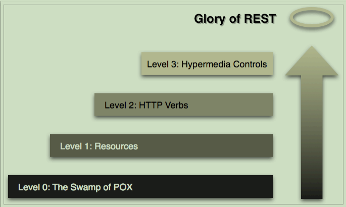

# 设计好的RESTful Web Service
> REST 提供了一组架构约束，当作为一个整体应用时，强调组件交互的可伸缩性、接口的通用性、组件的独立部署、以及用来减少交互延迟、增强安全性、封装遗留系统的中间组件。   ---Roy Thomas Fielding

## Richardson 成熟度模型 

## 如何实现Restful Web Service
+ 识别资源
+ 选择合适的资源粒度
+ 设计URI
+ 选择合适的HTTP方法和返回码
+ 设计资源的表述

## 识别资源
+ 找到领域名词
    - 能用CRUD操作的名词
+ 将资源组合为集合（即集合资源）
+ 将资源合并为复合资源
+ 计算或处理函数

## 资源的粒度
**服务端角度**
+ 网络效率
+ 表述的多少
+ 客户端的易用程度

**客户端的角度**
+ 可缓存性
+ 修改频率
+ 可变性

## 构建更好的URI
+ 使用域及子域对资源进行合理的分组或划分
+ 在URI的路径部分使用斜杆分隔符（/）来表示资源之间的层次关系
+ 在URI的路径部分使用逗号和分号来表示非层次元素
+ 使用连字符（-）和下划线（_）来改善长路径中名称的可读性
+ 在URI的查询部分使用‘与’符号（&）来分隔参数
+ 在URI中避免出现文件扩展名（例如： .php,.aspx和.jsp）

## 认识HTTP方法
| 动作  | 安全/幂等 | 用途   |
| ----  | ----      |---    |
| GET   | Y/Y      | 信息获取  |
| POST  | N/Y      | 该方法用途广泛，可用于创建、更新或一次性对多个资源进行修改|
|DELETE | N/Y      | 删除资源  |
| PUT   | N/Y      | 更新或者完全替换一个资源  |
| HEAD  | Y/Y      | 获取与GET一样的HTTP头信息，但是没有响应体 |
| OPTIONS| Y/Y     | 获取资源支持的HTTP方法列表     |
| TRACE | Y/Y      | 让服务器返回其收到的HTTP头    |
## URI与HTTP方法的组合
|  URI         |  HTTP方法  |  含义  |
|---           |  -----     | ---| 
| /coffee      |  GET       | 获取全部咖啡信息 |
| /coffee      |  POST      | 添加新的咖啡信息 |
| /coffee/{id} |  GET       | 获取特定咖啡信息 |
| /coffee/{id} |  DELETE    | 删除特定咖啡信息 |
| /coffee/{id} |  PUT       | 修改特定咖啡信息 |

## 认识HTTP状态码
| 状态码 |   描述   | 状态码 | 描述       |
| :---: | :---:    | :---: | :---:    |
| 200   | OK       | 400   | Bad Request |
| 201   | Created  | 401   | Unauthorized |
| 202   | Accepted | 403   | Forbidden    |
| 301   | Moved Permanently | 404   | Not Found    |
| 303   | See Other| 410   | Gone    |
| 304   | Not Modified | 500   | Internal Server Error    |      
| 307   | Temporary Redirect | 503 | Service Unavailable |

## 选择合适的表述
**JSON**
+ MappingJackson2HttpMessage
+ GsonHttpMessageConverter
+ JsonbHttpMessageConverter

**XML**
+ MappingJackson2XmlHttpMessageConverter
+ Jaxb2RootElementHttpMessageConverter

**HTML**
**ProtoBuf**
+ ProtobufHttpMessageConverter
