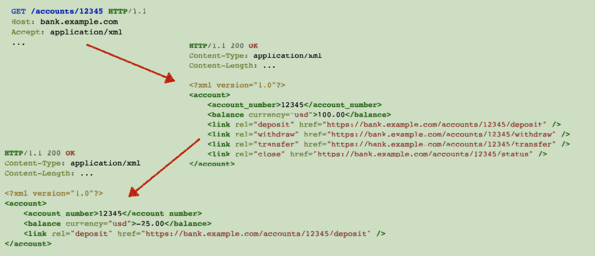

# 什么是HATEOAS
**Richardson成熟度模型**
+ Level3 -Hypermedia Controls

**HATEOS**
+ Hybermedia As The Engine Of Application State
+ REST 统一接口的必要组成部分
## HATEOAS vs WSDL
**HATEOAS**
+ 表述中的超链接会提供服务所需的各种REST接口信息
+ 无需事先约定如何访问服务

**传统的服务契约**
+ 必须事先约定服务的地址与格式

## HATEOAS示例

## 常用的超链接类型
| REL        | 描述  |
| :---:      | ----  |
| self       | 指向当前资源本身的链接  |
| edit       | 指向一个可以编辑当前资源的链接 |
| collection | 如果当前资源包含在某个集合中，指向该集合的链接 |
| search     | 指向一个可以检索氮气资源与其相关的资源的链接|
| related    | 指向一个与当前资源相关的链接  |
| first      | 集合遍历相关的类型，指向第一个资源的链接  |
| last       | 集合遍历相关的类型，指向最后一个资源的链接 |
| previous   | 集合遍历相关的类型，指向上一个资源的链接   |
| next       | 集合遍历相关的类型，指向下一个资源的链接   |

## 使用Spring Data REST 实现简单的超媒体服务
### 认识HAL
**HAL**
+ Hypertext Application Language
+ HAL是一种简单的格式，为API中的资源提供简单一致的链接

**HAL模型**
+ 链接
+ 内嵌资源
+ 状态

### Spring Data REST
**Spring Boot 依赖**
+ spring-boot-starter-data-rest

**常用的注解与类
+ @RespositoryRestResource
+ Resource<T>
+ PagedResource<T>

### 如何访问HATEOAS服务
**配置Jackson JSON**
+ 注册HAL支持

**操作超链接** 
+ 找到需要的link
+ 访问超链接

