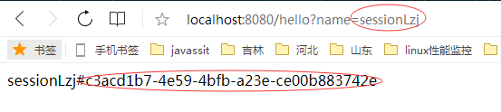
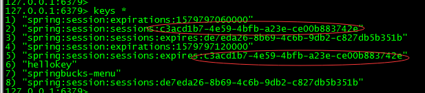
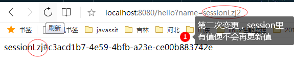

#  分布式环境Session的解决方案
## 常见的会话解决方案
+ 粘性会话 Sticky Session:根据用户路由，保障同一个用户始终路由到同一个节点上，存在缺陷是一个节点
+ 会话复制 Session Replication: 每台机器保存一样的会话副本
+ 集中会话 Centralized Session: 使用中间件集中存储会话信息

## 认识Spring Session
+ 简化集群中的用户会话管理
+ 无需绑定容器特定解决方案

**支持的存储**
+ Redis
+ MongoDB
+ JDBC
+ Hazelcast

## 实现原理
**定制HttpSession**
+ 通过定制的HttpServletRequest返回定制的HttpSession
    - SessionRepositoryRequestWrapper
    - SessionRepositoryFilter
    - DelegatingFilterProxy
## 基于Redis的HttpSession
+ 引入依赖
    - spring-session-data-redis
+ 基础配置
    - @EnableRedisHttpSession
    - 提供 RedisConnectionFactory
    - 实现 AbstractHttpSessionApplicationInitializer
        - 配置DelegatingFilterProxy

## Spring Boot对Spring Session的支持
**application.properties**
+ spring.session.store-type=redis
+ spring.session.timeout= 
    - server.servlet.session.timeout=
+ spring.session.redis.flush-mode=on-save
+ spring.session.redis.namespace=spring:session

## 示例： redis session验证
1. pom.xml添加配置
```xml
        <dependency>
            <groupId>org.springframework.boot</groupId>
            <artifactId>spring-boot-starter-data-redis</artifactId>
        </dependency>
        <dependency>
            <groupId>org.springframework.session</groupId>
            <artifactId>spring-session-data-redis</artifactId>
        </dependency>
```
2. application.properties添加redis信息
```properties
spring.redis.host=192.168.2.104
```
3. 示例代码
```java
@Slf4j
@RestController
@EnableRedisHttpSession
@SpringBootApplication
public class SessionDemoApplication {
    
    @RequestMapping("/hello")
    public String echoSessionInfo(HttpSession session, String name){
        log.info("SessionId:{}",session.getId());
        String storedName = (String) session.getAttribute("name");
        if(storedName == null){
            session.setAttribute("name",name+"#"+session.getId());
            storedName  = name+"#"+session.getId();
        }
        return storedName;
    }
    
    public static void main(String[] args) {
        SpringApplication.run(SessionDemoApplication.class, args);
    }

}
```
4. 运行结果
+ 第一次访问
<div align=center></div>  

+ 访问后redis中key值信息
<div align=center></div>

+ 变更name值再次访问 
<div align=center></div>


