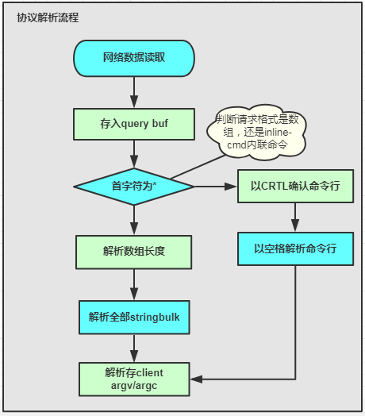

# Redis协议解析及处理
## 协议解析
请求命令进入，触发IO读事件后。client会从连接文件描述符读取请求，并存入client的query buffer（读缓冲区）中。client的读缓冲区默认16KB，如果发现读请求超过1GB，则直接异常，关闭连接。
进入读缓冲区后，之后开始对请求格式进行解析，解析主要根据请求格式的inline-cmd和数组两种方式由两个分支各自解析，最后请求参数个数存入client的argc，请求的具体参数参入argv中，详细处理流程图下图：  

## 协议执行
在协议解析完成存入client后，则进入协议执行部分，详细流程如下：  

# Redis的内部数据结构
## Redis db

## Redis Object实现

## Redis dict 实现

## dict的数据存储

## 简单动态字符串 sds

