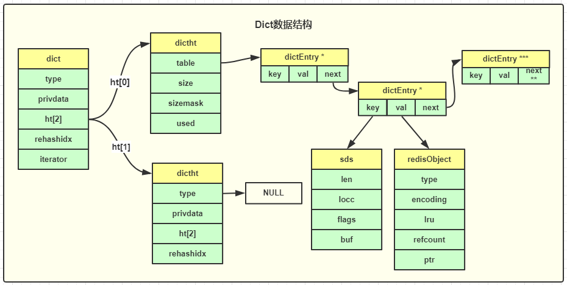

# Redis的内部数据结构
## RedisDB
redisServer数据都存储再redisDB中，一个redis默认最多支持16个DB，每个DB对应一个redisDb结构。用户访问时默认使用0号DB,可通过`select $dbID`在不通DB间切换。
每个db内部主要包括2个核心dict字典、3个非核心dict字典、dbID和其它辅助属性，详情如下：
+ 核心dict字典：
    - 主dict字典：存储当前DB中的所有数据，将key和各种数据类型的value关联起来，也称`key space`.
    - expires字典：存储带过期时间的key,是key和过期时间的映射。
+ 非核心dict:
    - blocking_keys(阻塞dict):存储阻塞等待状态的key及clients列表.比如，执行Redis中list的阻塞命令blpop、brpop或者brpoplpush时，如果该list列表为空，Redis就会将对应client设为阻塞状态，同时将该client添加到DB中blocking_keys这个阻塞列表中。
    - ready_keys(接触阻塞dict):存储解除阻塞的key和clients。当有其他调用方在向某个 key 对应的 list 中增加元素时，Redis 会检测是否有 client 阻塞在这个 key 上，即检查 blocking_keys 中是否包含这个 key，如果有则会将这个 key 加入 read_keys 这个 dict 中。同时也会将这个 key 保存到 server 中的一个名叫 read_keys 的列表中。这样可以高效、不重复的插入及轮询。
    - watched_keys:存储被watch命令监控的key及clients.

RedisDB中可以保存所有的数据类型，而Redis中所有数据类型都存在redisObject结构中。

## RedisObject
RedisObject由5个字段组成，各个字段内容如下：
+ type:Redis对象的数据类型，目前支持7种type
    - OBJ_STRING
    - OBJ_LIST
    - OBJ_SET
    - OBJ_ZSET
    - OBJ_HASH
    - OBJ_MODULE
    - OBJ_STREAM
+ encoding:对象的内部编码方式，目前支持10种
    - OBJ_ENCODING_RAW
    - OBJ_ENCODING_INT
    - OBJ_ENCODING_HT
    - OBJ_ENCODING_ZIPLIST
    - OBJ_ENCODING_INTSET
    - OBJ_ENCODING_SKIPLIST
    - OBJ_ENCODING_EMBSTR
    - OBJ_ENCODING_QUICKLIST
    - OBJ_ENCODING_STREAM
+ LRU: 存储淘汰数据用的LRU时间或LFU频率及时间的数据。
+ refcount:记录Redis对象的引用计数，用来表示对象被共享的次数，共享使用时加1，不在使用是减1，当计数为0时表明该对象没有被使用，就会释放，回收内存。
+ ptr: 指向对象的内部数据结构。比如string的对象，它的ptr指向sds或long

## 字典dict

### 实现
+ dict是Redis广泛使用的内部数据结构，类似于Memcached中hashtable。
+ 用于key或元素的快速插入、更新和定位。
+ 每个dict中有2个dictht(哈希表)，ht[0]日常访问，ht[1]用于rehash。
+ dictht中每个桶采用单向链表解决hash冲突。

### Dict数据存储
dictht中的table是一个hash表数组，每个桶指向一个dictEntry结构，dictEntry是一个单向链表，也是key-value映射存储结构。
+ dictEntry:
    + key 为sds字符串
    + value为各种数据类型的redisObject结构
+ Dict还是其它数据类型的内部结构
    - set集合
    - Hash 哈希，在元素数或value超过阈值时
        + 元素数超过 512 个
        +  value 大于 64 字节
         

