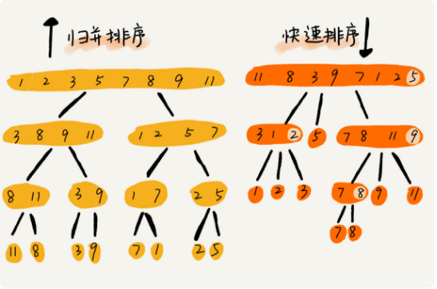

# 排序（下）

## 归并排序
1. 排序流程：
    + 数组从中间分成前后两部分，然后对前后两部分分别排序，再将排序好的两部分合并在一起
    + 使用分治思想，分而治之，大问题拆分小问题，小问题解决，大问题也解决。
2. 解题思路：
    + 递推公式：merge_sort(p...r) = merge(merge_sort(p...q),merge_sort(q+1...r))
    + 终止条件： p>=r 不用再继续分解 
    + 递归伪代码：
    ```java 
    // 归并排序算法, A是数组，n表示数组大小
    merge_sort(A, n) {
        merge_sort_c(A, 0, n-1)
    }

    // 递归调用函数
    merge_sort_c(A, p, r) {
        // 递归终止条件
        if p >= r  then return

        // 取p到r之间的中间位置q
        q = (p+r) / 2
        // 分治递归
        merge_sort_c(A, p, q)
        merge_sort_c(A, q+1, r)
        // 将A[p...q]和A[q+1...r]合并为A[p...r]
        merge(A[p...r], A[p...q], A[q+1...r])
    }

    merge(A[p...r], A[p...q], A[q+1...r]) {
        var i := p，j := q+1，k := 0 // 初始化变量i, j, k
        var tmp := new array[0...r-p] // 申请一个大小跟A[p...r]一样的临时数组
        while i<=q AND j<=r do {
            if A[i] <= A[j] {
                tmp[k++] = A[i++] // i++等于i:=i+1
            } else {
                tmp[k++] = A[j++]
            }
        }
        
        // 判断哪个子数组中有剩余的数据
        var start := i，end := q
        if j<=r then start := j, end:=r
        
        // 将剩余的数据拷贝到临时数组tmp
        while start <= end do {
            tmp[k++] = A[start++]
        }
        
        // 将tmp中的数组拷贝回A[p...r]
        for i:=0 to r-p do {
            A[p+i] = tmp[i]
        }
    } 
    ```
3. 执行效率：最好、最坏、平均情况时间复杂度均为O(nlogn)

4. 内存消耗：合并时，需要临时数组来保存合并，故空间复杂度O(n)

5. 稳定性： 稳定排序算法，因为存入是临时数组来并入，并不变动原数据前后顺序。
6. 实现示例：
    ```java
        public static void main(String[] args) {
            // TODO Auto-generated method stub
            int[] nums = {5,3,1,4,2};
            mergeSortC(nums,0,nums.length-1); 
            System.out.println(Arrays.toString(nums));
        }
        
        public static void mergeSortC(int[] nums,int p,int r){
            if(p>=r){
                return ;
            }
            int q = (p+r)/2; 
            mergeSortC(nums,p,q);
            mergeSortC(nums,q+1,r);
            mergeArr(nums,p,q,r);
        }
        public static void mergeArr(int[] nums,int p,int q,int r){
            int i = p;
            int j = q+1;
            int k = 0;
            int[] tmpArr = new int[r-p+1];
            while(i<=q && j<=r){
                if(nums[i]<=nums[j]){
                    tmpArr[k++]=nums[i++];
                }else{
                    tmpArr[k++]=nums[j++];
                }
            } 
            //判断是否有数组为合并完
            int start = i,end=q;
            if(j<=r){
                start=j;
                end=r;
            }
            while(start<=end){
                tmpArr[k++]=nums[start++];
            }
            
            //数据回填到数组
            for(i=0;i<=r-p;i++){
                nums[p+i] = tmpArr[i];
            }
        }
    ```

## 快速排序（Quicksort）
1. 排序流程：
    + 选择数组p到r之间的任意一个数据作为pivot(分区点)
    + 遍历p到r之间数据，小于pivot的放左边，大于pivot放右边，pivot放中间，这样数组就被分为3块（小于pivot+pivot+大于pivot）
    + 再将pivot前部分，和pivot后部分按上面逻辑再操作，直到区间缩小到1.
    + 快排使用到了分治+分区思想
2. 实现思路：
    + 递推公式：quick_sort(p…r) = quick_sort(p…q-1) + quick_sort(q+1…r)
    + 终止条件：q>=r
    + 伪代码：
    ```java 
    // 快速排序，A是数组，n表示数组的大小
    quick_sort(A, n) {
        quick_sort_c(A, 0, n-1)
    }
    // 快速排序递归函数，p,r为下标
    quick_sort_c(A, p, r) {
        if p >= r then return
        
        q = partition(A, p, r) // 获取分区点
        quick_sort_c(A, p, q-1)
        quick_sort_c(A, q+1, r)
    } 
    // 分区处理
    partition(A, p, r) {
        pivot := A[r]
        i := p
        for j := p to r-1 do {
            if A[j] < pivot {
            swap A[i] with A[j]
            i := i+1
            }
        }
        swap A[i] with A[r]
        return i
    }
    ```
3. 执行效率： 
    + 平均时间复杂度：O(nlogn)
    + 最坏时间复杂度：O(n<sup>2</sup>)
    + 出现最坏情况概率小，且可通过合理选择分区点规避，如上面伪代码方式实现，最坏情况为数据已经有序
4. 内存消耗：不建临时数组来交换数据，则空间复杂度O(1)
5. 稳定性：非稳定性排序算法
6. 代码示例：
```java
	public static void main(String[] args) { 
		int[] nums = {5,3,5,1,4,2}; 
		quickSort(nums,0,nums.length-1);
		System.out.println(Arrays.toString(nums));
	}
	/**
	 *  快排
	 * @param nums 数组
	 * @param p 分区开始下标
	 * @param r 分区结束下标
	 */
	public static void quickSort(int[] nums,int p,int r){
		if(p>=r){
			return;
		}
		int q = partitionQuickSort(nums, p, r);//获取分区点
		quickSort(nums, p, q-1);
		quickSort(nums, q+1,r); 
	}
	// 分区处理
	public static int partitionQuickSort(int[] nums,int p,int r){
		int pivot = nums[r];
		int i=p;
		for(int j=p;j<=r-1;j++){
			if(nums[j]<pivot){
				int tmp = nums[i];
				nums[i] = nums[j];
				nums[j] = tmp;
				i ++;
			}
		}
		nums[r] = nums[i];
		nums[i] = pivot;
		return i;
	}
```