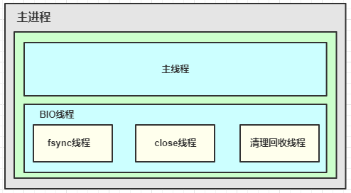

# Redis基础原理 
## Redis高性能
+ 单进程/单线程组件：网络IO和命令处理都核心进程中由单线程处理，不存在并发竞争，不需要加锁，没上下文切换开销。
+ Epoll事件模型：非阻塞网络IO。
+ 基于内存：所有数据操作都在内存中操作。

## Redis的进程机制 
核心线程除了IO与命令处理，还负责写数据到缓冲，以便将最新写操作同步到AOF、slave,所以除了主进程，Redis还会fork子进程，进行重负荷任务的处理，子进程主要有三种场景：
+ 收到bgrewriteaof命令时，Redis调用fork,构建一个子进程，子进程往临时AOF文件中，写入重建数据库状态的所有命令，当写入完毕，子进程则通知父进程，父进程把新增的写操作也追加到临时AOF文件，然后将临时文件替换老的AOF文件，并重命名。
+ 收到bgsave命令时，Redis构建子进程，子进程将内存中的所有数据通过快照做一次持久化落地，写入到RDB中。
+ 当需要进行全量复制时，master也会启动一个子进程，子进程将数据库快照保存到RDB文件，在写完RDB快照文件后，master就会把RDB发给slave,同时将后续新的写指令都同步给slave.

 

主进程中，除了主线程处理网络的IO和命令操作外，还有三个BIO辅助线程，分别负责处理文件关闭、AOF缓冲数据刷新到硬盘以及清理对象这三个任务队列。

Redis启动是，会同时启动这三个BIO线程，然后这三个线程休眠等待任务。当需要执行相关后台任务时，就会构建一个bio_job结构，记录任务参数，然后将bio_job追加到任务队列尾部，然后唤醒BIO线程，即可进行任务执行。  

## Redis持久化
Redis的持久化主要有RDB和AOF文件两种途径以及master-slave复制：
+ RDB： 记录某个时间点快照
    - 设置keys数阈值，超过则自动构建RDB内容快照（不推荐）。
    - 定时快照，一般选择业务低峰定时进行快照构建。
+ AOF(Append Only File):记录构建整个数据库内容的命令，随新的写操作不断追加操作。
    - bgrewriteaof指令：由于不断追加，AOF会记录数据的大量中间状态，此时，可以通过bgrewriteaof指令，对AOF进行重写，只保留数据最后内容，来缩减AOF的容量。
+ master-slave复制：支持master和slave的主动复制同步。
    - 初始流程：第一次建立连接，或者长时间断开连接后，缺失的指令超过master复制缓冲区的大小，都需要先进行一次全量同步。全量同步时，master会启动一个子进程，将数据库快照保存到文件中，然后将这个快照文件发给slave，同时将快照之后的写指令也同步给slave。全量同步完成后，如果slave 短时间中断，然后重连复制，缺少的写指令长度小于 master的复制缓冲大小，master就会把slave 缺失的内容全部发送给slave，进行增量复制。
    - master-slave的交互：Redis 的master可以挂载多个slave，同时slave还可以继续挂载slave，通过这种方式，可以有效减轻master的压力，同时在 master挂掉后，可以在slave通过slaveof no one指令，使当前slave停止与master的同步，转而成为新的master。
## Redis集群管理
Redis的集群主要可以分成以下三种方式：
+ client主动分片：客户端对key做hash，自定义取模或一致性hash策略，把key读写分散到不同的redis策略。
+ 第三方proxy组件:把路由策略、后端Redis状态维护都交给proxy处理，client直接访问proxy，后端redis有变更，也只需修改proxy配置即可。
+ Redis cluster:Redis自身支撑的集群方案，引入哈希槽（slot）分配管理各个子节点。在需要扩缩容时，可在线通过cluster setslot命令以及migrate指令，将槽下所有key迁移到目标节点。

# Redis 数据类型
