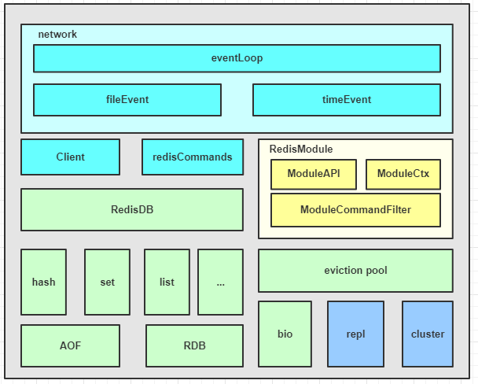

# Redis 系统架构

## 事件处理机制
+ 基于ae事件驱动模型：网络IO读写、命令执行、时间任务处理
+ IO读写：IO多路复用，基于ae事件模型对evport/epoll/kqueue/select进行封装，同时监听多个socket，并根据socket目前执行的任务，来为socket关联不同的事件处理器。
+ client结构：当监听端口对应的socket收到连接请求后，会创建一个client结构，对连接状态进行管理。在请求进入时，将请求命令读取缓冲并进行解析，并存入到client的参数列表。
+ redisCommand：请求命令找到对应redisCommand,根据命令协议，进一步解析、校验并执行。
+ 时间事件（timeEvent）:目前主要执行server定时任务，如统计更新、过期key清理、AOF及RDB持久化等辅助操作。
## 数据管理
+ redisDB组件：redis中数据存储由该组件实现，数据类型支持hash/set/list等等。Redis支持多DB，每个DB都对应一个redisDB结构。Redis的8种数据类型，每种都采用一种或多种内部数据结构来存储。同时这些内部数据结构及数据相关辅助信息，都以key/value格式存在redisDB的各个dict字典中。
+ 写指令流程：数据在写入redisDB后，同时会追加到AOF,数据快照定期落到rdb.
+ BIO线程：增加BIO子进程，处理易导致阻塞的文件close/fsync/lazyfree等操作。
+ key淘汰机制：设计8种淘汰策略，并引入eviction pool高效key淘汰与内存回收。 
## 功能扩展（Module sys） 
引入Modele System模块，插件化管理功能模块。  
+ 可插件化功能扩展
+ 动态链接库，按需加载（启动、运行）
+ 扩展开发：RedisModule_init 初始化模块，RedisModule_CreateCommand扩展各种新模块指令，插拔方式引入新数据结构和访问指令。
## 系统扩展
+ 主从复制（master-slave）:
    - 通过psyn多场景进行增量同步
    - 读写分离，提升系统稳定读写能力
+ 集群管理，slot维度
    - 读写，重定向，引入slot槽，对数据进行水平拆分，以及各节点slot管理
    - 支持数据迁移，实现在线扩容