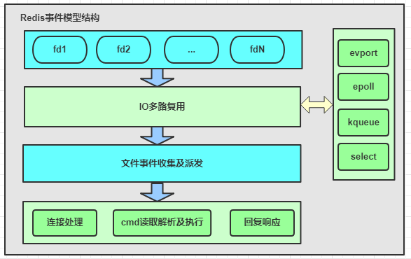

# Redis的事件驱动模型
Redis是一个事件驱动程序，基于自开发的AE事件驱动模型（A simple event-driven programming library）。此处并没有使用libevent或libev开源库，作者解释是尽量减少外部依赖，而自行开发的简洁、轻便、高效且易控制事件驱动库，核心代码小于1k。   
Redis的事件处理机制封装在aeEventLoop等相关结构中，网络连接、命令读取执行回复，数据的持久化、淘汰回收key等几乎所有核心操作均通过该事件模型处理。

Redis的事件驱动模型主要处理2类事件：
+ 文件事件：连接建立、接受请求命令、发送响应等。
+ 时间事件：Redis中定期执行的统计、key淘汰、缓存数据写出、rehash等。

## 文件处理事件

+ 文件处理事件采用Reactor模式构建
+ 文件处理机制分为4部分
    - 连接socket/文件描述符 Handler
    - IO多路复用程序Demultiplexer
    - 文件事件分派器 Dispatcher
    - 事件处理器 Event handler

+ IO多路复用程序
    + 提供相同api实现，编译时按性能选择最佳
    + 封装多种实现
        - Evport Solaries
        - Epoll Linux
        - Kqueue Unix
        - select 备选
### 文件事件收集及派发
+ 收集已发生事件，放入firedEvents中
+ 多路复用事件转为对应AE读写事件
    - EPOLLIN-->AE_READABLE
    - EPOLLOUT/ERR/HUP-->AE_WRITABLE
+ 根据事件类型，派发给对应事件处理函数

### 文件事件处理函数类型（主要分3种）
+ 新连接进入
    - acceptCommonHandler处理
    - accept新连接，获取调用方ip及端口
    - 创建client,并注册读事件
+ 请求命令到达
    + readQueryFromClient处理
    + 读取网络IO,存入client的query缓冲
    + 解析命令，支持两种格式：inline/multibulk
    + 从命令表获取cmd，校验参数/存储/状态
    + 命令执行
    + 将响应写入写缓存
+ 响应回复
    - 事件循环，按需注册client的写事件，client fd与AE_WRITABLE间接关联
    - 写事件触发，将client的写缓冲中的数据写往网络

## 时间事件
+ 时间事件在特定时间执行的事件
+ 时间事件构建链表，在ae事件机制循环中轮询执行
+ 核心处理函数有两个
    - serverCron
    - moduleTimerHandler
+ 时间事件分类
    - 单次事件，执行完毕事件结束
    - 周期性事件，执行完毕后继续设置下次执行时间

+ 时间事件的5个属性组成
    - 事件ID: Redis为时间事件创建全局唯一ID,该ID按从小到大的顺序进行递增。
    - 执行时间when_sec和when_ms:精确到毫秒，记录该事件的到达可执行时间。
    - 时间事件处理器timeProc:在事件事件到达时，Redis会调用相应的timeProc处理事件。
    - 关联数据clientData:在调用timeProc时，需要使用该关联数据作为参数。
    - 链表指针prev和next: 用来将时间事件维护为双向链表，便于插入及查找所要执行的时间事件。

+ 时间时间处理流程（aeProcessEvents）：
1. 遍历所有的时间事件。
2. 比较事件的时间和当前时间，找出可执行的时间事件。
3. 执行时间事件的timeProc函数。
4. 执行完毕后，对于周期性，设置新执行时间；对于单次性任务，设置事件ID为-1，后续在事件循环中，下次执行aeProcessEvent的时候从链表中删除。